```mermaid
flowchart TB
    REPO["nodejs-backend-engineering-lab"]

    REPO --> ROOT["Arquivos principais"]
    REPO --> SUPPORT["Recursos de apoio"]
    REPO --> LABS["Laboratórios práticos"]
    REPO --> FINAL["Projeto final"]

    ROOT --> README["README.md<br/>Visão geral do portfólio"]
    ROOT --> ROADMAP["roadmap.md<br/>Planejamento e progresso"]
    ROOT --> LICENSE["LICENSE<br/>Licença MIT"]
    ROOT --> GITIGNORE[".gitignore<br/>Arquivos ignorados pelo Git"]

    SUPPORT --> ASSETS["assets/<br/>Banners, diagramas e imagens"]
    SUPPORT --> DOCS["docs/<br/>Documentação complementar"]
    SUPPORT --> TEMPLATES["templates/<br/>Modelos padronizados"]
    SUPPORT --> GITHUB[".github/<br/>Issues, pull requests e workflows"]

    LABS --> FOUNDATION["Fundamentos<br/>LAB 01 ao LAB 04"]
    LABS --> API["Desenvolvimento de APIs<br/>LAB 05 ao LAB 07"]
    LABS --> DATA["Persistência de dados<br/>LAB 08 ao LAB 12"]
    LABS --> QUALITY["Qualidade e entrega<br/>LAB 13 ao LAB 15"]
    LABS --> PRODUCTION["Operação e segurança<br/>LAB 16 ao LAB 19"]

    FOUNDATION --> NODE["Node.js"]
    FOUNDATION --> TYPESCRIPT["TypeScript"]
    FOUNDATION --> EXPRESS["Express"]
    FOUNDATION --> NESTJS["NestJS"]

    API --> REST["APIs REST"]
    API --> VALIDATION["DTOs e validação"]
    API --> AUTH["Autenticação JWT"]

    DATA --> POSTGRES["PostgreSQL"]
    DATA --> TYPEORM["TypeORM"]
    DATA --> CRUD["CRUD"]
    DATA --> PAGINATION["Paginação"]
    DATA --> FILTERS["Filtros e busca"]

    QUALITY --> DOCKER["Docker"]
    QUALITY --> TESTS["Testes com Jest"]
    QUALITY --> SWAGGER["Swagger / OpenAPI"]

    PRODUCTION --> LOGS["Logs estruturados"]
    PRODUCTION --> OBSERVABILITY["Observabilidade"]
    PRODUCTION --> ERRORS["Tratamento de erros"]
    PRODUCTION --> SECURITY["Segurança"]

    FINAL --> DEALERSHIP["LAB 20<br/>Sistema de Gestão para Concessionárias"]

    classDef main fill:#1e293b,color:#ffffff,stroke:#38bdf8,stroke-width:2px;
    classDef group fill:#0f172a,color:#ffffff,stroke:#64748b,stroke-width:1.5px;
    classDef item fill:#f8fafc,color:#0f172a,stroke:#94a3b8,stroke-width:1px;
    classDef final fill:#7f1d1d,color:#ffffff,stroke:#ef4444,stroke-width:2px;

    class REPO main;
    class ROOT,SUPPORT,LABS,FINAL,FOUNDATION,API,DATA,QUALITY,PRODUCTION group;
    class README,ROADMAP,LICENSE,GITIGNORE,ASSETS,DOCS,TEMPLATES,GITHUB,NODE,TYPESCRIPT,EXPRESS,NESTJS,REST,VALIDATION,AUTH,POSTGRES,TYPEORM,CRUD,PAGINATION,FILTERS,DOCKER,TESTS,SWAGGER,LOGS,OBSERVABILITY,ERRORS,SECURITY item;
    class DEALERSHIP final;
```

# Node.js Backend Engineering Lab

> Repositório contendo laboratórios práticos voltados para vagas de Desenvolvedor Backend Júnior utilizando Node.js, TypeScript, NestJS, PostgreSQL, Docker, Jest e boas práticas de arquitetura.

---

## Objetivo

Este repositório foi desenvolvido para consolidar conhecimentos práticos exigidos pelo mercado para posições de **Desenvolvedor Backend Júnior**.

Ao longo dos laboratórios será construída uma aplicação real utilizando tecnologias amplamente utilizadas em empresas de desenvolvimento de software, evoluindo gradualmente desde os fundamentos do Node.js até uma aplicação completa com autenticação, testes, documentação e observabilidade.

---

## Tecnologias

- Node.js
- TypeScript
- NestJS
- Express
- PostgreSQL
- TypeORM
- Docker
- Jest
- Swagger (OpenAPI)
- JWT
- Git
- Prometheus
- OpenTelemetry
- Pino Logger

---

## Competências Desenvolvidas

- APIs REST
- Arquitetura em Camadas
- SOLID
- Clean Architecture
- Injeção de Dependências
- Autenticação
- Validação de Dados
- CRUD
- Paginação
- Filtros
- Testes Automatizados
- Logs Estruturados
- Métricas
- Tracing Distribuído
- Tratamento Global de Erros
- Segurança

---

# Roadmap

| Status | Laboratório |
|:------:|-------------|
| ⬜ | LAB 01 — Fundamentos do Node.js |
| ⬜ | LAB 02 — Fundamentos do TypeScript |
| ⬜ | LAB 03 — Primeira API com Express |
| ⬜ | LAB 04 — Primeira API com NestJS |
| ⬜ | LAB 05 — APIs REST |
| ⬜ | LAB 06 — Validação de Dados |
| ⬜ | LAB 07 — Autenticação com JWT |
| ⬜ | LAB 08 — PostgreSQL |
| ⬜ | LAB 09 — TypeORM |
| ⬜ | LAB 10 — CRUD Completo |
| ⬜ | LAB 11 — Paginação |
| ⬜ | LAB 12 — Filtros e Busca |
| ⬜ | LAB 13 — Docker |
| ⬜ | LAB 14 — Testes Automatizados |
| ⬜ | LAB 15 — Documentação com Swagger |
| ⬜ | LAB 16 — Logs Estruturados |
| ⬜ | LAB 17 — Métricas e Observabilidade para Desenvolvedores |
| ⬜ | LAB 18 — Tratamento Global de Erros |
| ⬜ | LAB 19 — Segurança |
| ⬜ | LAB 20 — Projeto Final |

---

# Projeto Final

Todos os laboratórios evoluem uma única aplicação.

Ao final do roadmap será desenvolvido um sistema completo de gestão para concessionárias de veículos.

## Funcionalidades

- Cadastro de Clientes
- Cadastro de Veículos
- Cadastro de Vendedores
- Propostas Comerciais
- Test Drive
- Agenda
- Ordens de Serviço
- Histórico de Atendimento
- Dashboard
- Relatórios

---

# Estrutura do Repositório

```
.
├── assets/
├── docs/
├── templates/
├── LAB 01 - Fundamentos do Node.js/
├── LAB 02 - Fundamentos do TypeScript/
├── LAB 03 - Primeira API com Express/
├── ...
├── LAB 20 - Projeto Final/
├── README.md
└── roadmap.md
```


---





---

# Diferenciais

Além dos conteúdos normalmente encontrados em cursos introdutórios, este repositório também aborda:

- Arquitetura documentada em Mermaid
- Diagramas de fluxo
- Projeto incremental
- Observabilidade aplicada ao desenvolvimento
- Logs estruturados
- Métricas
- Tracing distribuído
- Documentação profissional
- Organização semelhante a projetos corporativos

---

# Observabilidade para Desenvolvedores

Um dos laboratórios é dedicado à implementação de recursos normalmente encontrados em aplicações utilizadas em produção.

Serão abordados:

- Logs estruturados com Pino
- Métricas Prometheus
- Tracing com OpenTelemetry
- Endpoints `/health` e `/metrics`
- Boas práticas de monitoramento

---

# Objetivo do Portfólio

Este repositório faz parte de um conjunto de projetos desenvolvidos para demonstrar competências práticas em Engenharia de Software, Desenvolvimento Backend, APIs, Cloud Computing e Observabilidade.

---

# Licença

Este projeto utiliza a licença MIT.
