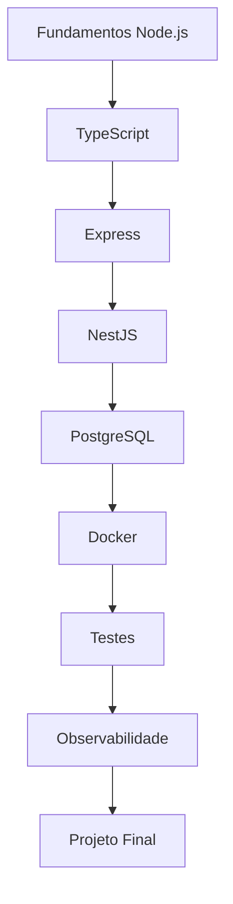

<div align="center">

<p align="center">
    
</p>

# 🚀 Node.js Backend Engineering Lab

### Laboratórios práticos para preparação de Desenvolvedores Backend Júnior

Repositório focado na construção de aplicações modernas utilizando **Node.js**, **TypeScript**, **NestJS**, **PostgreSQL**, **Docker**, **Jest** e **boas práticas de arquitetura**, simulando a evolução de um projeto utilizado em ambiente corporativo.

---


</div>

---

## Visão Geral



---

# 📖 Sobre o Projeto

Este repositório reúne uma sequência de laboratórios práticos desenvolvidos para preparar candidatos para vagas de **Desenvolvedor Backend Júnior**.

O objetivo não é apenas ensinar uma tecnologia específica, mas sim demonstrar como um sistema backend evolui desde sua criação até um ambiente semelhante ao encontrado em empresas de desenvolvimento de software.

Durante os laboratórios será construída uma única aplicação, que receberá novas funcionalidades e melhorias de arquitetura de forma incremental.

---

# 🎯 Objetivos

Ao concluir este repositório, o desenvolvedor terá praticado:

- Desenvolvimento Backend moderno
- Node.js
- TypeScript
- NestJS
- APIs REST
- PostgreSQL
- TypeORM
- Docker
- Testes Automatizados
- Documentação OpenAPI
- Autenticação JWT
- Logs Estruturados
- Observabilidade
- Boas práticas de Segurança
- SOLID
- Clean Architecture

---

# 🛠️ Tecnologias

| Categoria | Tecnologias |
|------------|-------------|
| Linguagem | Node.js, TypeScript |
| Framework | NestJS, Express |
| Banco de Dados | PostgreSQL |
| ORM | TypeORM |
| Containers | Docker |
| Testes | Jest |
| Documentação | Swagger / OpenAPI |
| Segurança | JWT, Helmet |
| Observabilidade | Pino, OpenTelemetry, Prometheus |
| Versionamento | Git e GitHub |

---

# 🗺️ Roadmap

| Status | Laboratório |
|:------:|-------------|
| ⬜ | LAB 01 — Fundamentos do Node.js |
| ⬜ | LAB 02 — Fundamentos do TypeScript |
| ⬜ | LAB 03 — Primeira API com Express |
| ⬜ | LAB 04 — Primeira API com NestJS |
| ⬜ | LAB 05 — APIs REST |
| ⬜ | LAB 06 — Validação de Dados |
| ⬜ | LAB 07 — Autenticação com JWT |
| ⬜ | LAB 08 — PostgreSQL |
| ⬜ | LAB 09 — TypeORM |
| ⬜ | LAB 10 — CRUD Completo |
| ⬜ | LAB 11 — Paginação |
| ⬜ | LAB 12 — Filtros e Busca |
| ⬜ | LAB 13 — Docker |
| ⬜ | LAB 14 — Testes Automatizados |
| ⬜ | LAB 15 — Documentação com Swagger |
| ⬜ | LAB 16 — Logs Estruturados |
| ⬜ | LAB 17 — Observabilidade para Desenvolvedores |
| ⬜ | LAB 18 — Tratamento Global de Erros |
| ⬜ | LAB 19 — Segurança |
| ⬜ | LAB 20 — Projeto Final |

---

# 🏗️ Arquitetura do Repositório

```text
.
├── assets/
│   ├── banners/
│   ├── diagrams/
│   └── screenshots/
│
├── docs/
│
├── templates/
│
├── LAB 01 - Fundamentos do Node.js/
├── LAB 02 - Fundamentos do TypeScript/
├── LAB 03 - Primeira API com Express/
├── ...
├── LAB 20 - Projeto Final/
│
├── README.md
├── roadmap.md
├── CONTRIBUTING.md
├── CHANGELOG.md
├── LICENSE
└── .gitignore
```

---

# 🚗 Projeto Final

Ao longo dos laboratórios será desenvolvido um sistema completo de gestão para concessionárias de veículos.

O projeto evoluirá continuamente, simulando o desenvolvimento incremental utilizado em equipes profissionais.

## Funcionalidades

- Cadastro de Clientes
- Cadastro de Veículos
- Cadastro de Vendedores
- Propostas Comerciais
- Test Drive
- Agenda
- Ordens de Serviço
- Histórico de Atendimento
- Dashboard
- Relatórios

---

# ⭐ Diferenciais

Este repositório procura ir além dos exemplos tradicionais encontrados em cursos introdutórios.

Entre os diferenciais estão:

- Projeto único evoluindo ao longo de todos os laboratórios
- Arquitetura documentada em Mermaid
- Estrutura semelhante à utilizada em projetos corporativos
- Código organizado em camadas
- Commits organizados
- Documentação técnica detalhada
- Boas práticas de Engenharia de Software
- Observabilidade aplicada ao desenvolvimento backend

---

# 📊 Observabilidade

Um laboratório específico será dedicado à implementação de recursos normalmente encontrados em aplicações em produção.

Serão abordados:

- Logs estruturados com Pino
- Métricas com Prometheus
- Tracing distribuído com OpenTelemetry
- Health Checks
- Endpoints `/health`
- Endpoints `/metrics`

---

# 🎓 Objetivo Educacional

Este repositório faz parte de um conjunto de projetos desenvolvidos para demonstrar competências práticas em:

- Desenvolvimento Backend
- Engenharia de Software
- APIs REST
- Cloud Computing
- Observabilidade
- DevOps

---

# 🤝 Contribuições

Sugestões de melhorias, correções e novas ideias são sempre bem-vindas.

Caso identifique algum problema ou queira contribuir com o projeto, fique à vontade para abrir uma *Issue* ou enviar um *Pull Request*.

---

# 📄 Licença

Este projeto é distribuído sob a licença **MIT**.
